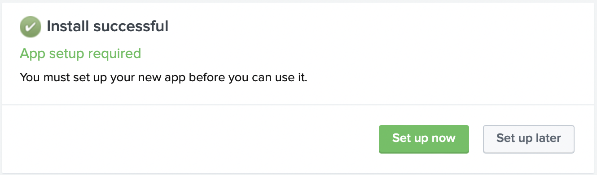
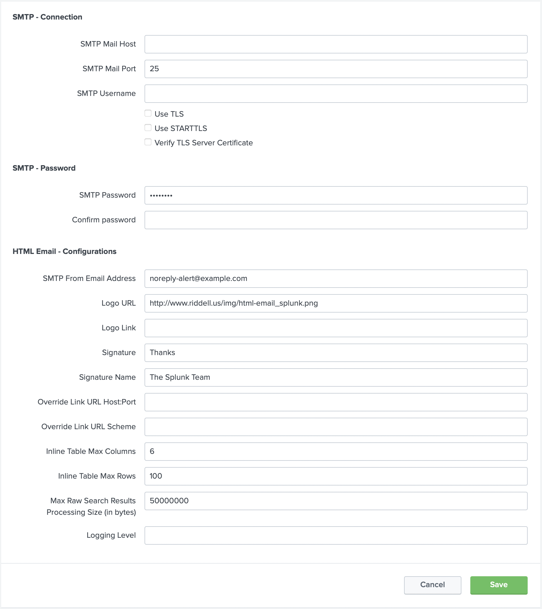
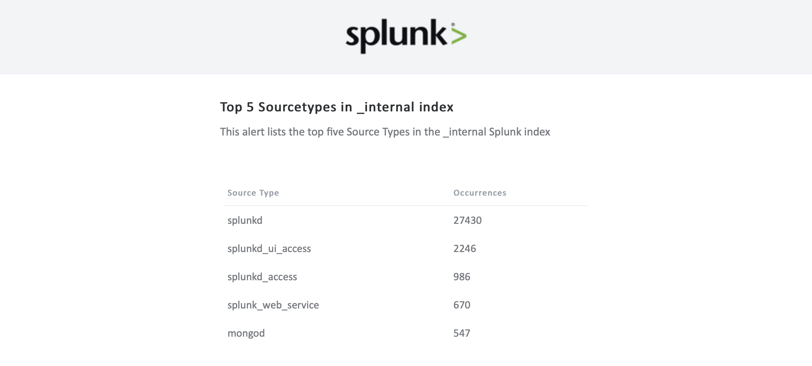
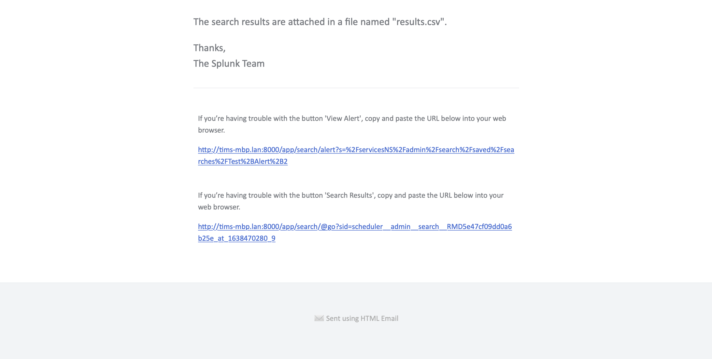
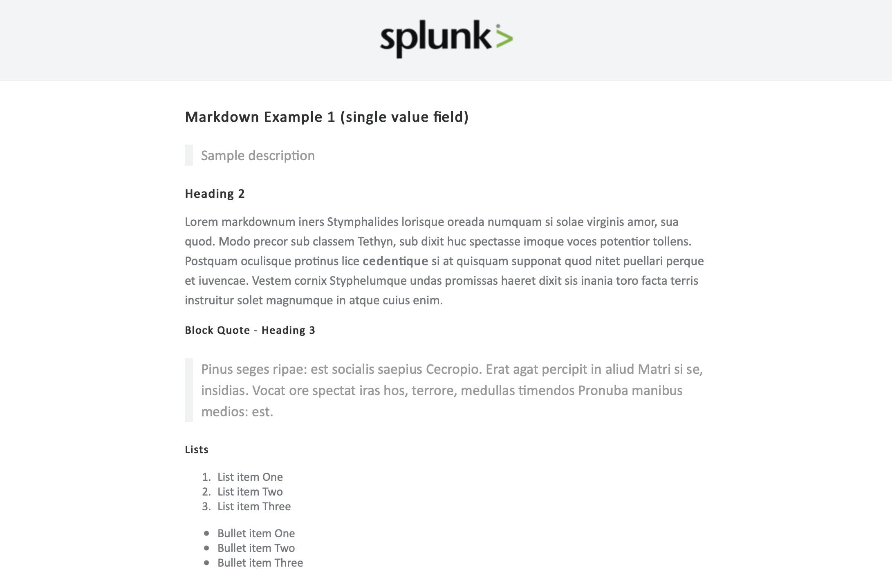
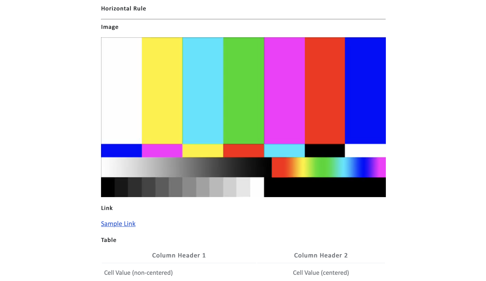
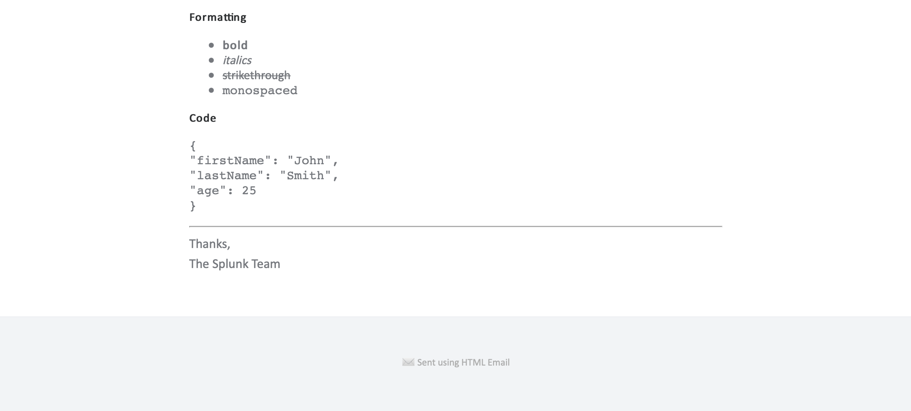
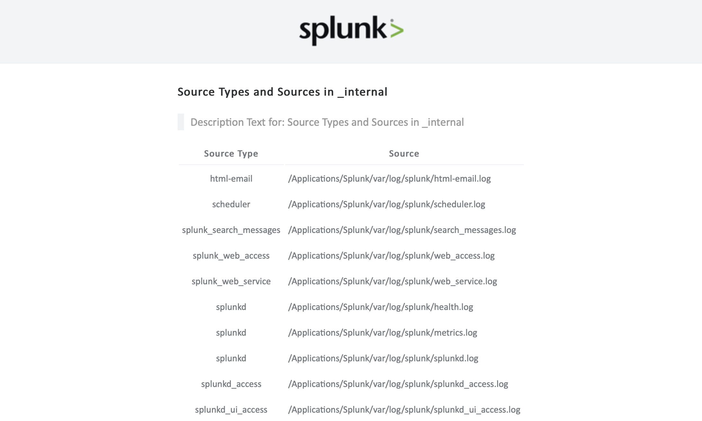

# TA-html-email


A Splunk add-on to send HTML-based email with rich formatting options.

## Install

After installing the `.tgz` file, Splunk will prompt to be restarted.

At the following dialog box, click *Set up later*.



Then, in the list of installed applications, click *Set up* for the `HTML Email` application.


In the top sections, fill in the required details to connect to the SMTP server. In the third section, set the application default configurations.



Note:

* If a username and password are not required, leave them blank.
* Some servers only allow certain "from" email addresses.
* Office 365 configuration:
  * Host: `smtp.office365.com`
  * Port: `587`
  * Requires `Use TLS`
  * Requires `Use STARTTLS`
  * Requires valid "from" address
  * Requires `SmtpClientAuthentication` enabled for mailbox: [Documentation](https://aka.ms/smtp_auth_disabled)

## Test

Create an "alert" in Splunk based on a simple SPL search. Here is an example:

```
index=_internal 
| stats count by sourcetype 
| sort - count 
| head 5
| rename sourcetype as "Source Type", count as "Occurrences"
```

### General configurations:

* Cron: `/2 * * * *` - Every two minutes, disable after testing is complete
* Trigger: Once
* Action: `HTML Email`

### HTML Email configurations:

* Subject: Top 5 Sourcetypes in _internal index
* Description: This alert lists the top five Source Types in the _internal Splunk index
* Source: `Search Results`
* Options:
  * `Attach CSV`
  * `Include Description`
  * `Inline Table`
  * `Link to Alert`
  * `Link to Search Results`

### Resulting Email





### Attached `results.csv ` file contents

```
Source Type,Occurrences
splunkd,27430
splunkd_ui_access,2246
splunkd_access,986
splunk_web_service,670
mongod,547
```

## Debug

* The application is written in Go and is included as a binary file for the darwin, linux, and windows platforms.
* The application source is available at: https://github.com/triddell/TA-html-email
* The [Hermes](https://github.com/matcornic/hermes) project is used for the basic email formatting.
* Application logs are written to `$SPLUNK_HOME/var/log/splunk/html-email.log` and can be searched in the `_internal` index using Splunk SPL: `index=_internal source=*html-email.log`

## Markdown support (experimental)

The test email above used the `Search Results` source option. An additional option exists called `Markdown (experimental)`. Using this feature, ad hoc email body text can be generated using [markdown](https://www.markdownguide.org/basic-syntax/) syntax.

### Markdown Example 1 (single-value field)

* When using a single-valued field, the resulting field name must be `body_string`
* Options:
  * Source: `Markdown (experimental)`
  * Global Option: `Include Description`
  
#### Alert SPL

```
index=_internal
| head 1
| eval body_string="## Heading 2
 
Lorem markdownum iners Stymphalides lorisque oreada numquam si solae virginis amor, sua quod. Modo precor sub classem Tethyn, sub dixit huc spectasse imoque voces potentior tollens. Postquam oculisque protinus lice **cedentique** si at quisquam supponat quod nitet puellari perque et iuvencae. Vestem cornix Styphelumque undas promissas haeret dixit sis inania toro facta terris instruitur solet magnumque in atque cuius enim.
 
### Block Quote - Heading 3
 
> Pinus seges ripae: est socialis saepius Cecropio. Erat agat percipit in aliud
> Matri si se, insidias. Vocat ore spectat iras hos, terrore, medullas timendos
> Pronuba manibus medios: est.
 
### Lists
 
1. List item One
2. List item Two
3. List item Three
 
* Bullet item One
* Bullet item Two
* Bullet item Three
 
### Horizontal Rule
 
---
 
### Image
 

 
### Link
 
[Sample Link](https://www.google.com)
 
### Table
 
| Column Header 1 | Column Header 2 |
| ------------- | :-------------: |
| Cell Value (non-centered)   | Cell Value (centered)    |
 
### Formatting
 
* **bold**
* *italics*
* ~~strikethrough~~
* `monospaced`
 
### Code
 
\```
{
\"firstName\": \"John\",
\"lastName\": \"Smith\",
\"age\": 25
}
\```"
| table body_string
```

* Note: Remove the `\` from in front of triple backtick code block delimiters above.

#### Resulting Email





### Markdown Example 2 (multi-value field)

* When using a single-valued field, the resulting field name must be `body`
* Options:
  * Source: `Markdown (experimental)`
  * Global Option: `Include Description`

#### Alert SPL

```
index=_internal 
| head 5000
| eval body = "| ".sourcetype." | ".source." |"
| stats count by body
| stats list(body) as body
| eval body=mvappend("| :---: | --- |", body)
| eval body=mvappend("| Source Type | Source |", body)
```

#### SPL Results

* A single result row (in this case) with a multi-valued `body` field

*`body`*
```
| Source Type | Source |
| :---: | --- |
| splunk_search_messages | /Applications/Splunk/var/log/splunk/search_messages.log |
| splunkd | /Applications/Splunk/var/log/splunk/health.log |
| splunkd | /Applications/Splunk/var/log/splunk/metrics.log |
| splunkd | /Applications/Splunk/var/log/splunk/splunkd.log |
| splunkd_access | /Applications/Splunk/var/log/splunk/splunkd_access.log |
| splunkd_ui_access | /Applications/Splunk/var/log/splunk/splunkd_ui_access.log |
```

#### Resulting Email



